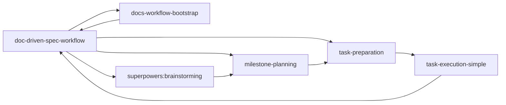
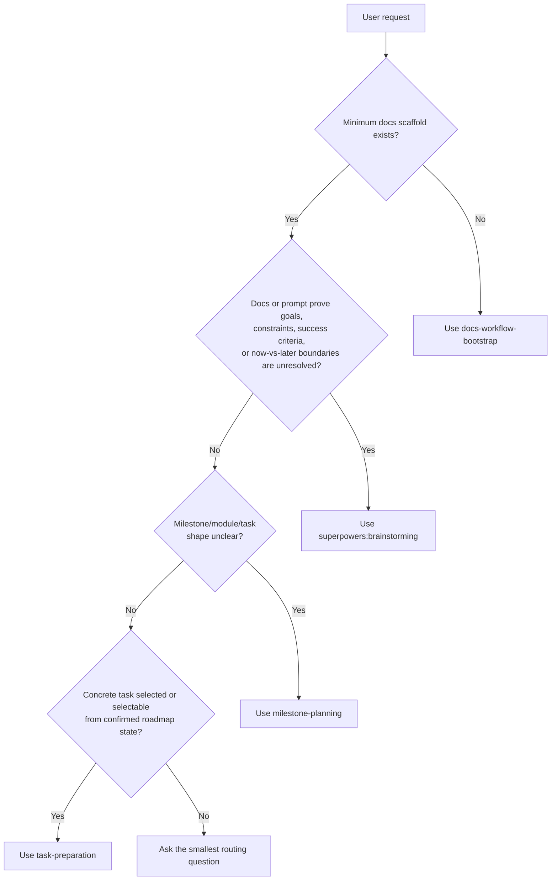
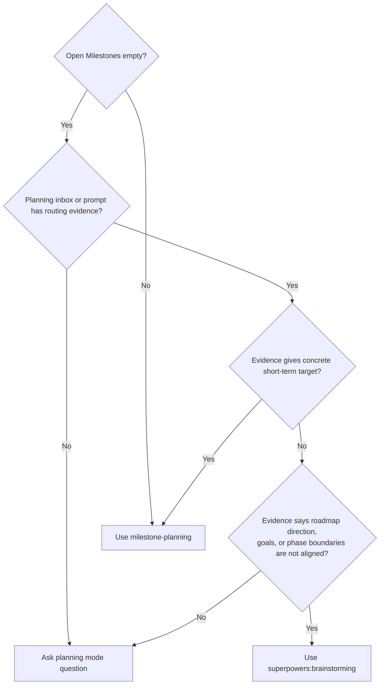
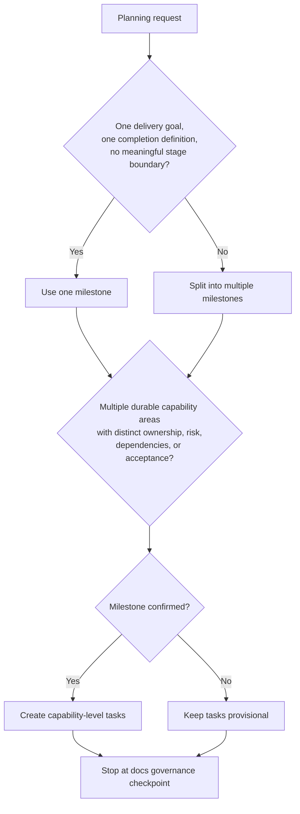
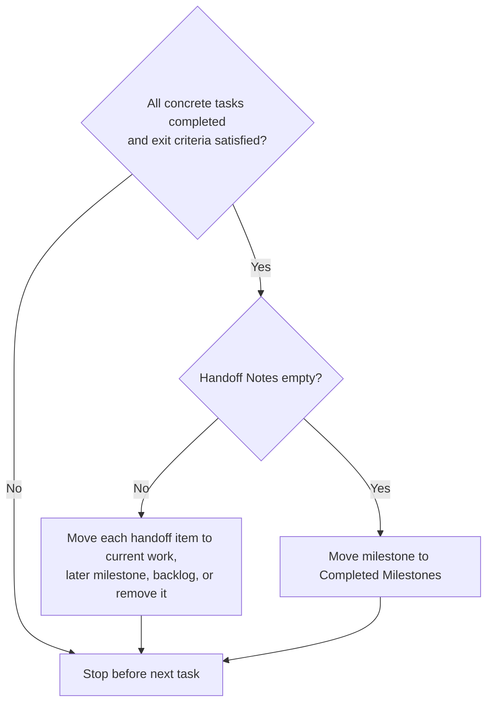
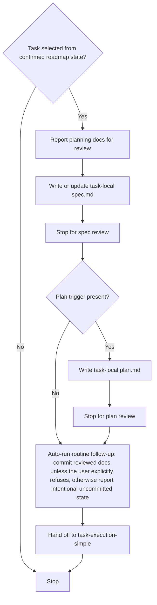
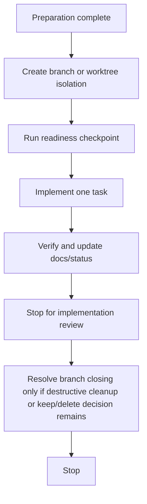

# Workflow Structure

This document explains the routing model behind `doc-driven-spec-workflow`.
It is a map of the process, not a replacement for the stage skills.

## Core Principle

The workflow is document-driven. A fresh agent conversation should recover the current stage from repository documents and the current prompt, not from chat memory.

Use evidence in this order:

1. `docs/tasks/index.md`
2. `docs/tasks/planning-inbox.md`
3. relevant milestone, module, and task docs under `docs/tasks/`
4. `docs/architecture/` for stable constraints
5. `docs/context/` for supporting, non-authoritative research
6. the current user prompt

Missing docs are not proof that goals are unclear. Missing docs are a routing signal.

## Stage Chain



The root skill chooses one stage skill. Stage skills own their own templates, edits, and stop points.

## Top-Level Routing



Do not infer ambiguity from absence alone. If the evidence does not identify the next stage, ask a routing question instead of guessing.

## Minimum Scaffold

`docs-workflow-bootstrap` creates only the minimum entry points:

```text
docs/
├── index.md
├── architecture/
│   └── index.md
├── tasks/
│   ├── index.md
│   └── planning-inbox.md
└── context/
    └── index.md
```

Bootstrap does not create milestones, implementation tasks, task-local specs, plans, or code changes. If the user provides roadmap-like content during bootstrap, it can be recorded only as compact planning inbox context when explicitly requested, then handed off to `milestone-planning`.

## Planning Inbox Routing

`docs/tasks/planning-inbox.md` stores goals that are not yet milestone-shaped. It prevents fresh conversations from losing product intent.



Recommended candidate shape:

```md
### <Candidate Name>

- Status: needs alignment | ready to decompose | parked | discarded
- Source: <user request, research note, handoff, or other origin>
- Problem: <what need or opportunity this represents>
- Current question: <what must be decided next>
- Next routing: brainstorming | milestone-planning | backlog | discard
```

## Milestone Planning

`milestone-planning` owns roadmap-layer governance:

- milestone boundaries
- optional module grouping
- task breakdown
- backlog and handoff governance
- roadmap-layer `docs/tasks/` documents

It does not write task-local `spec.md`, create `plan.md`, run readiness checks, or implement code.



Tasks are capability outcomes, not implementation mechanics. Tests, docs updates, migrations, refactors, and verification belong inside the relevant task.

## Milestone Confirmation

`Roadmap confirmed: no` means tasks are candidate planning output only.

If the user asks to decompose or start work inside an unconfirmed milestone, ask whether to:

- re-evaluate milestone structure first, or
- continue on the current milestone path for provisional decomposition

Continuing on the current path does not automatically change `Roadmap confirmed` to `yes`. Flip it only when the user explicitly confirms the milestone roadmap structure.

## Milestone Closure



Completed milestones are frozen. Follow-up work belongs in a later milestone, backlog, or planning inbox.

## Task Preparation

`task-preparation` begins only when a concrete task is selected or selectable from confirmed roadmap state, with dependencies and prior hard gates clear.

A task is selectable only when all of these are true:

- its milestone has `Roadmap confirmed: yes`
- previous milestone closure is resolved when crossing milestones
- task status is `planned` or `in_progress`
- task dependencies are satisfied or explicitly waived
- no previous branch-closing or milestone-transition hard gate is unresolved
- the user selected it, or `docs/tasks/` clearly identifies it as next by order and status

`task-preparation` owns:

- planning-entry review when `milestone-planning` has just created or reshaped roadmap/task docs
- task-local `spec.md`
- optional task-local `plan.md`
- review pauses for `spec.md` and `plan.md`
- routine follow-up after review, with reviewed docs committed by default unless the user explicitly says not to commit them; intentional uncommitted state is an explicit exception that must be reported
- handoff context into an execution skill

It does not own implementation edits, branch/worktree isolation, readiness, code verification, docs/status updates after code changes, or branch closing.



Default to no `plan.md`. Create `plan.md` only when at least one plan trigger is present:

- 3 or more major files/modules must change and modification order affects correctness
- database schema, migration, data backfill, or persisted format changes
- public API, CLI, configuration format, plugin interface, or task document format compatibility boundary
- cross-module coordination such as auth plus billing plus audit, or parser plus adapter plus renderer
- phased rollout, feature flag, migration transition, dual-write, or dual-read behavior
- non-obvious verification order
- multiple implementation slices that remain one task and should not be split by `milestone-planning`
- exploratory spike or risk-reduction step is required before implementation edits

Do not create `plan.md` for a small single-capability task with straightforward implementation order. If plan trigger status is uncertain, name the suspected trigger and ask before writing `plan.md`.

## Simple Execution

`task-execution-simple` begins after `task-preparation` has finished its task-local docs and routine follow-up, and the task is ready for straightforward direct execution.

`task-execution-simple` owns:

- branch/worktree isolation
- readiness checks
- implementation edits
- verification
- docs/status updates caused by implementation
- implementation review pause
- branch closing and cleanup hard gates



## Pause Semantics

This workflow distinguishes three kinds of stops:

- Review pause: the agent stops so the user can review the current output.
- Operational step: the agent may need to commit, update task status, create branch isolation, or perform another routine continuation step before the next stage.
- Hard gate: the agent must ask before a destructive or high-risk decision.

A review pause means the workflow can safely resume in a fresh conversation without relying on chat memory. It does not, by itself, create a separate approval gate for the follow-up commit or handoff step.

Default review pauses:

- Bootstrap review pause: report created or changed scaffold files.
- Planning review pause: report roadmap, milestone, task, inbox, or backlog docs created or changed by `milestone-planning`.
- Task spec review pause: report the written or updated task-local `spec.md`.
- Task plan review pause: report the written or updated task-local `plan.md` when a plan exists.
- Implementation review pause: report verified code plus docs and task status updates before any destructive cleanup choice.

Default continuation behavior after a review pause:

- If the user clearly expresses an intent to move forward after review, treat that as approval to follow the recommended path. Do not require a specific phrase.
- The recommended path may include routine operational steps such as committing reviewed docs, updating task status, creating branch/worktree isolation, or moving into the next workflow stage.
- After a reviewed `spec.md` or `plan.md`, the default routine operational step is to commit the reviewed task-local docs before handing off into execution unless the user explicitly says not to commit them.
- Explicit refusal is required to skip that commit. Statements such as `ok, but I don't want to commit that yet` or `continue, but leave the spec uncommitted` count as that exception.
- If the agent intentionally continues with reviewed changes uncommitted, it must treat that as an explicit user-approved exception, say so clearly, give the reason, and report the affected files.
- Before handing off to the next stage, the agent must state the `AutoOps` outcome: either the reviewed docs were committed, or they remain intentionally uncommitted with files listed.
- Do not auto-commit before first reporting the result that the user is reviewing.

## Hard Gates

Keep explicit confirmation only for decisions with non-obvious cost or destructive effect.

`continue` is not enough for:

- roadmap confirmation when the milestone structure itself is still explicitly unconfirmed
- staying on the current branch when isolation risk is non-trivial
- deleting a branch or worktree
- destructive cleanup
- crossing into a later milestone while an earlier milestone still appears open and not intentionally closed

When a stop is a review pause rather than a hard gate, the user does not need to separately approve both the reviewed artifact and the next routine commit. Review approval and commit approval are merged by default.

Examples of merged approval:

- User reviews a new `spec.md` and says `continue` -> agent should commit the reviewed spec by default, then move into plan/readiness/coding as appropriate.
- User reviews a new `spec.md` and says `ok, but I don't want to commit that yet` -> agent should keep it uncommitted, report that explicit exception and the affected files, then continue only through the next non-destructive step.
- User reviews planning docs and says `next step` -> agent may checkpoint those planning docs and then enter task-local spec work if the workflow is otherwise ready.

Examples of hard gates:

- `delete the merged task branch`
- `stay on the current branch`
- `keep this milestone unconfirmed and continue with provisional planning`

## Source Boundaries

| Document area | Owns | Must not own |
| --- | --- | --- |
| `docs/architecture/` | stable behavior, design constraints, long-lived boundaries | volatile research or task state |
| `docs/tasks/index.md` | open/completed milestones and planning links | modules, task counts, implementation details |
| `docs/tasks/planning-inbox.md` | unconfirmed goals and roadmap candidates | formal task execution state |
| `docs/tasks/backlog.md` | known deferred roadmap items | vague product direction with unresolved alignment |
| `docs/tasks/<milestone>/` | milestone goal, status, modules/tasks, handoff notes | task-local implementation design |
| `docs/tasks/<task>/task.md` | task placement, dependencies, status, acceptance points | detailed implementation plan |
| `docs/tasks/<task>/spec.md` | behavior, scope, exclusions, tradeoffs | branch/worktree or execution logistics |
| `docs/tasks/<task>/plan.md` | implementation sequencing and verification order | new scope or roadmap reshaping |
| `docs/context/` | supporting research and unstable notes | stable system rules or concrete task selection |

When a conclusion in `docs/context/` becomes a stable rule, move or restate it in `docs/architecture/`.

## Pressure-Test Targets

Use these scenario families to verify the workflow:

- empty `Open Milestones` with no planning inbox evidence
- planning inbox candidate marked `needs alignment`
- planning inbox candidate marked `ready to decompose`
- bootstrap request bundled with roadmap and spec demands
- unconfirmed milestone where user asks to start work
- completed milestone with non-empty `Handoff Notes`
- selected task with unapproved spec
- approved spec awaiting the next operational step
- simple selected task where `plan.md` should be skipped
- complex selected task where `plan.md` is justified
- completed task with worktree removed but task branch still open
