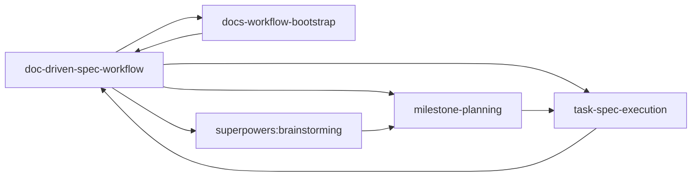
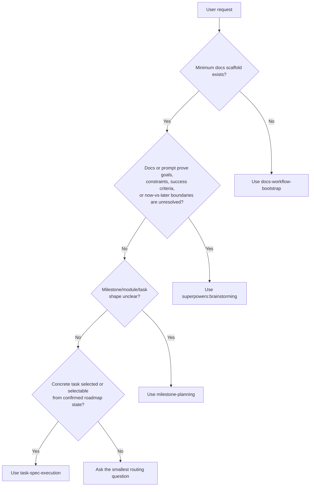
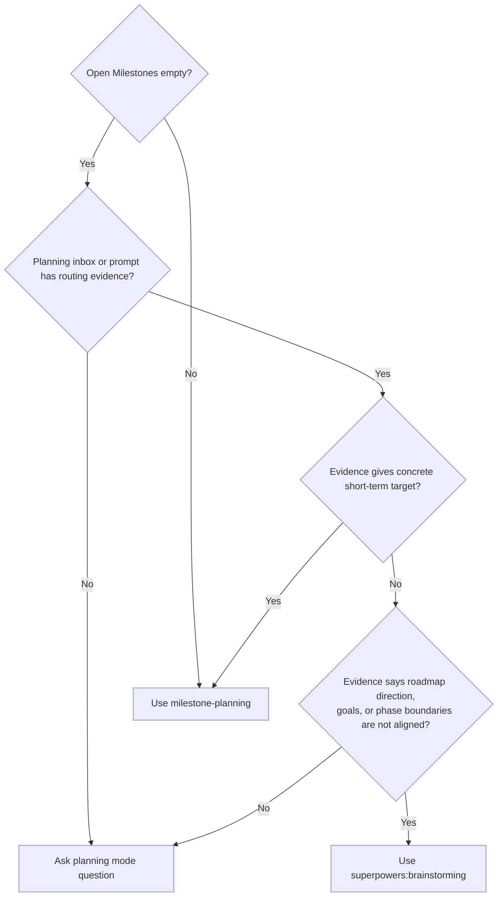
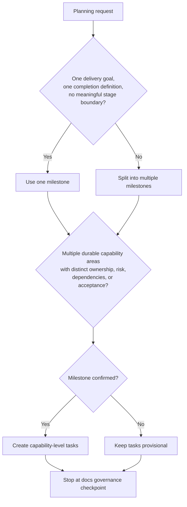
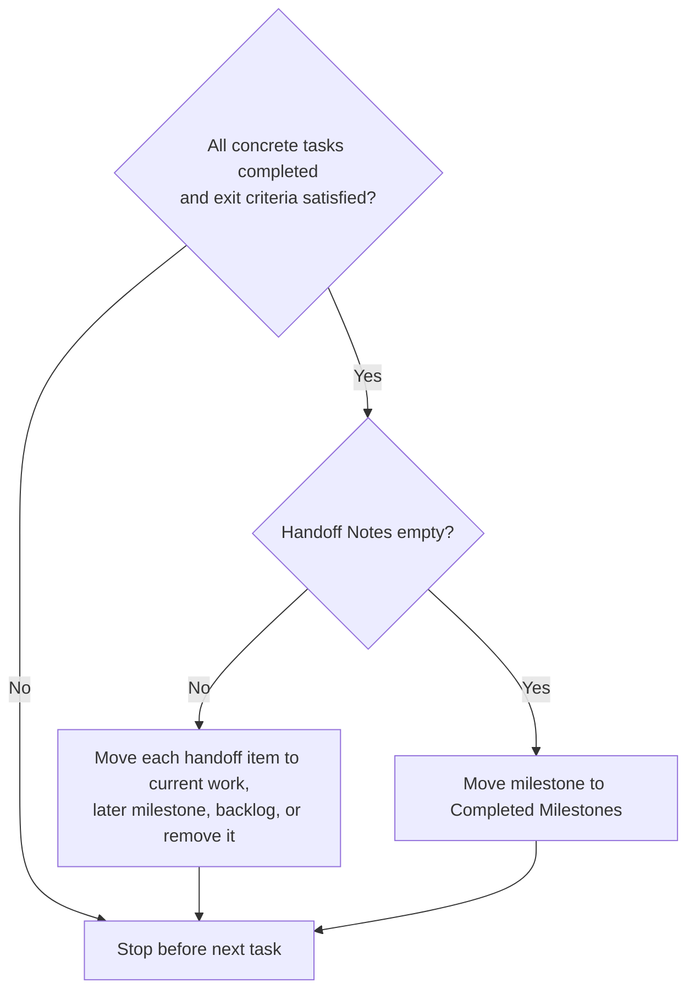
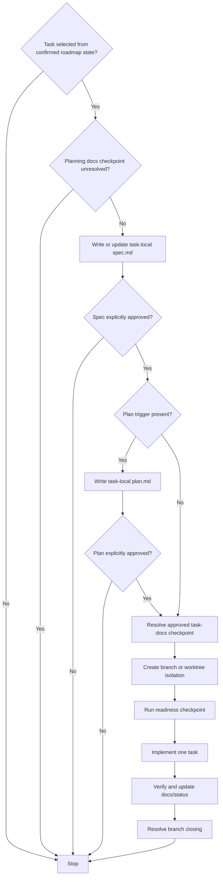

# Workflow Structure

This document explains the routing model behind `doc-driven-spec-workflow`.
It is a map of the process, not a replacement for the stage skills.

## Core Principle

The workflow is document-driven. A fresh agent conversation should recover the current stage from repository documents and the current prompt, not from chat memory.

Use evidence in this order:

1. `docs/tasks/index.md`
2. `docs/tasks/planning-inbox.md`
3. relevant milestone, module, and task docs under `docs/tasks/`
4. `docs/architecture/` for stable constraints
5. `docs/context/` for supporting, non-authoritative research
6. the current user prompt

Missing docs are not proof that goals are unclear. Missing docs are a routing signal.

## Stage Chain



The root skill chooses one stage skill. Stage skills own their own templates, edits, and stop points.

## Top-Level Routing



Do not infer ambiguity from absence alone. If the evidence does not identify the next stage, ask a routing question instead of guessing.

## Minimum Scaffold

`docs-workflow-bootstrap` creates only the minimum entry points:

```text
docs/
├── index.md
├── architecture/
│   └── index.md
├── tasks/
│   ├── index.md
│   └── planning-inbox.md
└── context/
    └── index.md
```

Bootstrap does not create milestones, implementation tasks, task-local specs, plans, or code changes. If the user provides roadmap-like content during bootstrap, it can be recorded only as compact planning inbox context when explicitly requested, then handed off to `milestone-planning`.

## Planning Inbox Routing

`docs/tasks/planning-inbox.md` stores goals that are not yet milestone-shaped. It prevents fresh conversations from losing product intent.



Recommended candidate shape:

```md
### <Candidate Name>

- Status: needs alignment | ready to decompose | parked | discarded
- Source: <user request, research note, handoff, or other origin>
- Problem: <what need or opportunity this represents>
- Current question: <what must be decided next>
- Next routing: brainstorming | milestone-planning | backlog | discard
```

## Milestone Planning

`milestone-planning` owns roadmap-layer governance:

- milestone boundaries
- optional module grouping
- task breakdown
- backlog and handoff governance
- roadmap-layer `docs/tasks/` documents

It does not write task-local `spec.md`, create `plan.md`, run readiness checks, or implement code.



Tasks are capability outcomes, not implementation mechanics. Tests, docs updates, migrations, refactors, and verification belong inside the relevant task.

## Milestone Confirmation

`Roadmap confirmed: no` means tasks are candidate planning output only.

If the user asks to decompose or start work inside an unconfirmed milestone, ask whether to:

- re-evaluate milestone structure first, or
- continue on the current milestone path for provisional decomposition

Continuing on the current path does not automatically change `Roadmap confirmed` to `yes`. Flip it only when the user explicitly confirms the milestone roadmap structure.

## Milestone Closure



Completed milestones are frozen. Follow-up work belongs in a later milestone, backlog, or planning inbox.

## Task Execution

`task-spec-execution` begins only when a concrete task is selected or selectable from confirmed roadmap state, with dependencies and prior checkpoints clear.

A task is selectable only when all of these are true:

- its milestone has `Roadmap confirmed: yes`
- previous milestone closure is resolved when crossing milestones
- task status is `planned` or `in_progress`
- task dependencies are satisfied or explicitly waived
- no previous task checkpoint, planning docs checkpoint, or branch closing gate is unresolved
- the user selected it, or `docs/tasks/` clearly identifies it as next by order and status



Default to no `plan.md`. Create `plan.md` only when at least one plan trigger is present:

- 3 or more major files/modules must change and modification order affects correctness
- database schema, migration, data backfill, or persisted format changes
- public API, CLI, configuration format, plugin interface, or task document format compatibility boundary
- cross-module coordination such as auth plus billing plus audit, or parser plus adapter plus renderer
- phased rollout, feature flag, migration transition, dual-write, or dual-read behavior
- non-obvious verification order
- multiple implementation slices that remain one task and should not be split by `milestone-planning`
- exploratory spike or risk-reduction step is required before implementation edits

Do not create `plan.md` for a small single-capability task with straightforward implementation order. If plan trigger status is uncertain, name the suspected trigger and ask before writing `plan.md`.

## Checkpoint Semantics

A checkpoint means the workflow can safely resume in a fresh conversation without relying on chat memory.

Default checkpoint resolutions:

- Bootstrap checkpoint: report created or changed scaffold files; commit only when the user requested it.
- Planning docs checkpoint: commit roadmap, milestone, task, inbox, or backlog docs created or changed by `milestone-planning` when the user asks to resolve the checkpoint.
- Task spec checkpoint: commit the approved task-local `spec.md` when the user asks to resolve the checkpoint.
- Task plan checkpoint: commit the approved task-local `plan.md` together with the approved `spec.md` when a plan exists and the user asks to resolve the checkpoint.
- Implementation checkpoint: commit verified code plus docs and task status updates when the user asks to resolve the checkpoint.
- Branch closing checkpoint: resolve merge, PR, keep, discard, worktree cleanup, and task branch cleanup decisions, or explicitly record which of those are being deferred.

Allowed alternative:

- The user may explicitly approve keeping changes uncommitted.
- If changes remain uncommitted, the agent must report the affected files and state which checkpoint gate that explicit decision satisfies.

Content approval and checkpoint resolution are different gates. For example, approving `spec.md` does not by itself resolve the task spec checkpoint. Before implementation isolation, the approved task docs must either be committed or explicitly approved to remain uncommitted.

Do not auto-commit docs governance changes before reporting the result or before the user confirms checkpoint resolution.

## Approval Gates

`continue` is not approval for:

- roadmap structure
- spec approval
- plan approval
- docs checkpoint decisions
- branch closing
- destructive cleanup

`continue` may advance only when the current stage is complete and no explicit approval gate is outstanding.

Explicit approval must name the artifact or decision being approved, such as:

- `approve the spec`
- `approve plan.md`
- `confirm this milestone roadmap`
- `commit the planning docs`
- `keep these docs uncommitted and continue`
- `delete the merged task branch`

These are not explicit approval unless they answer a specific yes/no or either/or approval question:

- `continue`
- `ok`
- `looks good`
- `go ahead`
- `sure`

## Source Boundaries

| Document area | Owns | Must not own |
| --- | --- | --- |
| `docs/architecture/` | stable behavior, design constraints, long-lived boundaries | volatile research or task state |
| `docs/tasks/index.md` | open/completed milestones and planning links | modules, task counts, implementation details |
| `docs/tasks/planning-inbox.md` | unconfirmed goals and roadmap candidates | formal task execution state |
| `docs/tasks/backlog.md` | known deferred roadmap items | vague product direction with unresolved alignment |
| `docs/tasks/<milestone>/` | milestone goal, status, modules/tasks, handoff notes | task-local implementation design |
| `docs/tasks/<task>/task.md` | task placement, dependencies, status, acceptance points | detailed implementation plan |
| `docs/tasks/<task>/spec.md` | behavior, scope, exclusions, tradeoffs | branch/worktree or execution logistics |
| `docs/tasks/<task>/plan.md` | implementation sequencing and verification order | new scope or roadmap reshaping |
| `docs/context/` | supporting research and unstable notes | stable system rules or concrete task selection |

When a conclusion in `docs/context/` becomes a stable rule, move or restate it in `docs/architecture/`.

## Pressure-Test Targets

Use these scenario families to verify the workflow:

- empty `Open Milestones` with no planning inbox evidence
- planning inbox candidate marked `needs alignment`
- planning inbox candidate marked `ready to decompose`
- bootstrap request bundled with roadmap and spec demands
- unconfirmed milestone where user asks to start work
- completed milestone with non-empty `Handoff Notes`
- selected task with unapproved spec
- approved spec without docs checkpoint
- simple selected task where `plan.md` should be skipped
- complex selected task where `plan.md` is justified
- completed task with worktree removed but task branch still open
